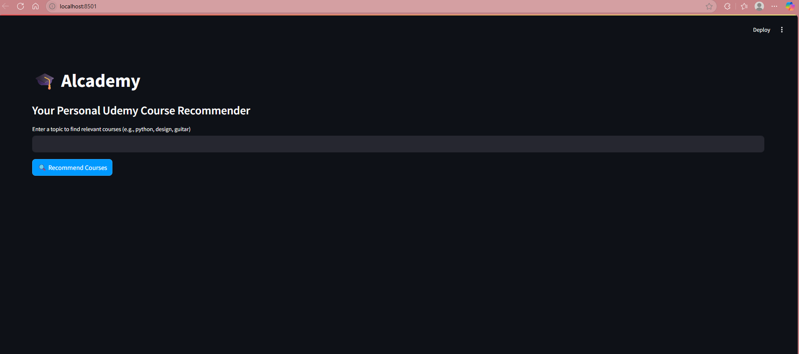
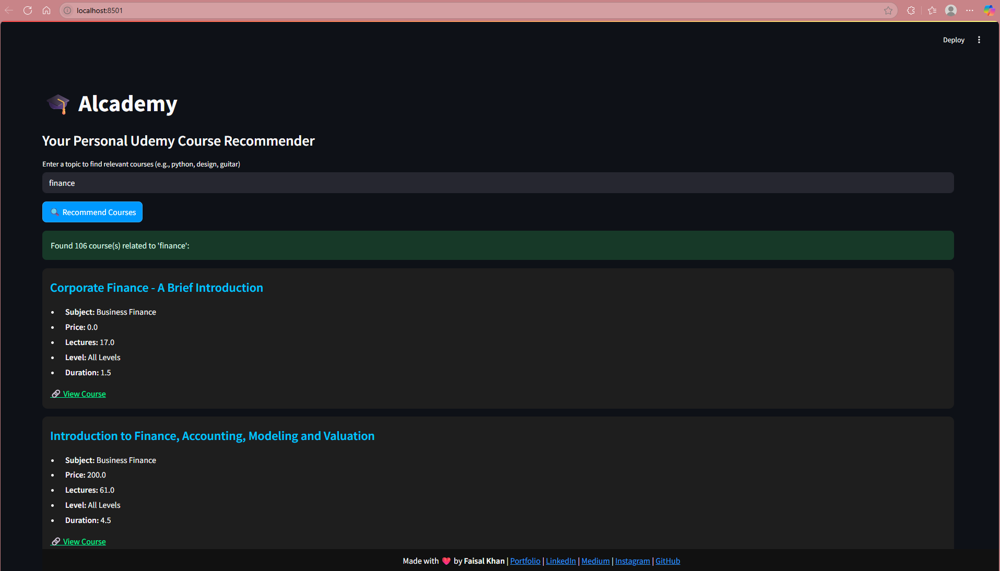

# 🎓 Alcademy — Course Recommendation Engine

**Alcademy** is a topic-based Udemy course recommendation engine built with **Flask (Python 3.13.2)**. It provides users with curated courses from various domains like Web Development, Business, Design, and Music based on their input query.


---

## 🔥 Features

- 🧠 Machine learning-based recommendation using course title similarity
- 🔍 Topic-based course search (e.g., "python", "design", "guitar")
- 🎨 Visually appealing UI with modern minimal design & animations
- 📱 Fully responsive and mobile-friendly layout
- 📄 Detailed course info in results: **URL, Price, Lectures, Level, Duration, Subject**
- 🔗 Social links footer with icons
- 🚫 Custom 404 error page for better UX

---

## 🚀 Live Demo

👉 [**View Live Demo**](https://alcademy.streamlit.app/)

---

## 📂 Project Structure

```

Alcademy/
│
├── app.py
├── model.joblib
├── courses.pkl
├── vectorizer.joblib
├── requirements.txt
│
├── assets/
│ └── cover_image.png
│
├── data/
│ ├── 3.1-data-sheet-udemy-courses-business-courses.csv
│ ├── 3.1-data-sheet-udemy-courses-design-courses.csv
│ ├── 3.1-data-sheet-udemy-courses-music-courses.csv
│ ├── 3.1-data-sheet-udemy-courses-web-development.csv
│ └── Entry Level Project Sheet - 3.1-data-sheet-udemy-courses-web-development.csv


```

---

## 🧠 How it Works

- Courses from different CSV datasets are merged into a single DataFrame.
- A simple keyword-matching model (saved as `model.joblib`) is trained in Colab.
- On form submission, matching courses are returned with rich metadata.

---

## 🚀 Getting Started

```bash
git clone https://github.com/khanfaisal79960/Alcademy.git
cd Alcademy
python -m venv venv
source venv/bin/activate  # or .\venv\Scripts\activate on Windows
pip install -r requirements.txt
streamlit run app.py
```

---

## 🛠️ Tech Stack

- **Backend**: Flask (Python 3.13.2)
- **Frontend**: HTML, CSS, Bootstrap, Font Awesome
- **Modeling**: Pandas, scikit-learn
- **Export**: `joblib` for model serialization

---

## 📷 Project Screenshots

| Home Page | Recommendations |
|-----------|-----------------|
|  |  |

---

## 🙋‍♂️ Author

**Faisal Khan**

- 🌐 [Portfolio](https://khanfaisal.netlify.app)
- 💼 [LinkedIn](https://www.linkedin.com/in/khanfaisal79960)
- ✍️ [Medium](https://medium.com/@khanfaisal79960)
- 📸 [Instagram](https://instagram.com/mr._perfect_1004)
- 💻 [GitHub](https://github.com/khanfaisal79960)

---
